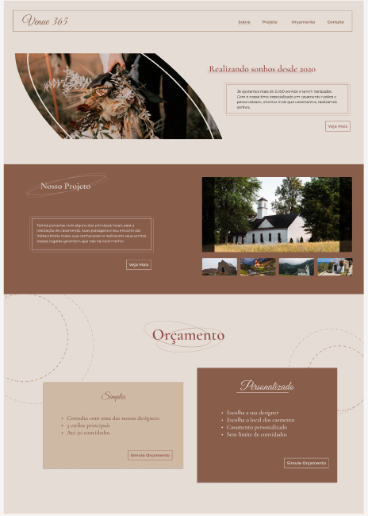
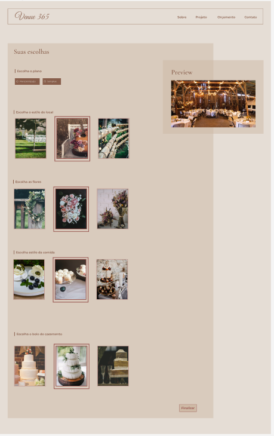
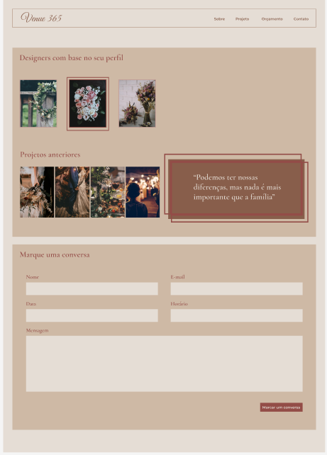
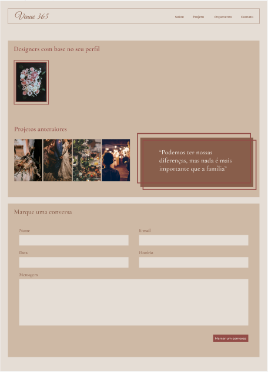

# Venue 650

:construction: Projeto em construção :construction:

## Build Setup

```bash
# install dependencies
$ yarn install

# serve with hot reload at localhost:3000
$ yarn dev

# build for production and launch server
$ yarn build
$ yarn start

# generate static project
$ yarn generate
```

## Idealização do Projeto

Esse projeto foi criado com a intensão de praticar design com a proposta dada no curso [Foundations of User Experience (UX) ](https://www.coursera.org/learn/foundations-user-experience-design). Além de conhecer um pouco mais sobre Nuxt e Tailwind.

O projeto escolhido foi Preview app for a rustic weeding venue. As análises feitas foram:

---

**Quais seriam as necessidades, desafios e preocupações a serem resolvidos?**

- Dificuldade de encontrar um bom lugar
- Difícil de estimar o preço
- Estilo de casamento não bater com a personalidade do casal
- Dificuldade de entender o back stage
- Ser caro

---

**Ideia**

- A escolha de designer com base em um questionário

- Ter dois planos:
  - Simples
  - Personalizado

No plano simples, o casamento teria menos persolidades para encaixar e reutilizar o que já foi usado por aqueles que comprar o plano personalizado.
A outra ideia seria, aqueles designers que apresentam baixa demanda são realocados para realizar os casamento mais simples.

## Designer no Figma

O designer foi feito no [figma](https://www.figma.com/file/ZpRiz97ZyqKiaoFk0q2zF7/Venue-650?node-id=0%3A1)

Então temos a página inicial, falando sobre o projeto


O formulário para conhecer melhor os gostos do casal


O formulário para quem escolheu o plano personalizado


O formulário para quem escolheu o plano simples


## Tecnologias utilizadas

- [Nuxtjs](https://nuxtjs.org/)
- [Tailwindcss](https://tailwindcss.com/)

## Demo


